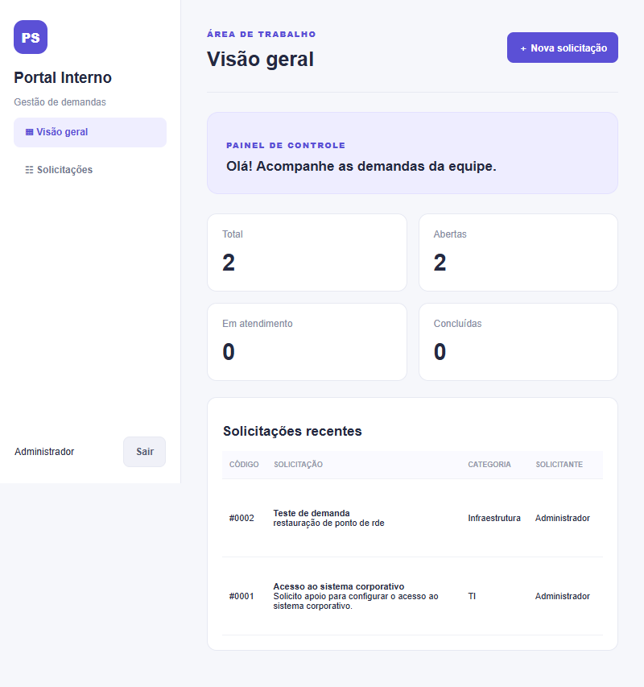
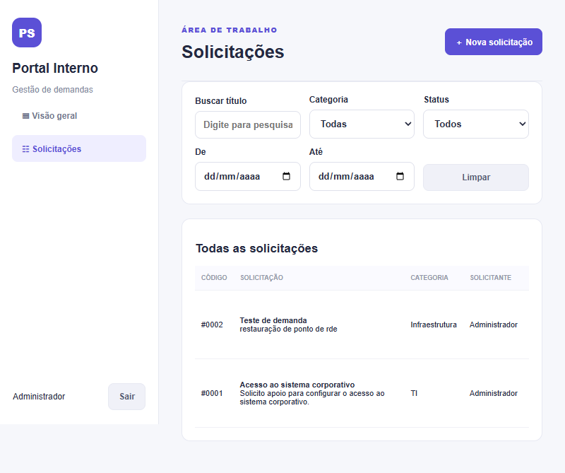
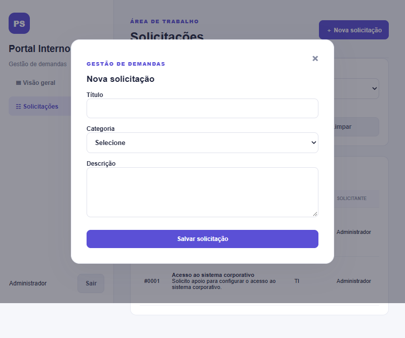

# Portal de Solicitações Internas

**Autor:** Gabriel Mota Silva · **Projeto de portfólio Full Stack** · **Criado em:** 29/09/2026

Aplicação web para registrar, organizar e acompanhar solicitações internas, com autenticação, painel de indicadores, filtros e persistência em SQLite.

## Visão geral

O Portal de Solicitações Internas demonstra uma implementação full stack com Node.js, JavaScript, HTML, CSS e SQLite. O backend fornece uma API JSON; o frontend permite acompanhar solicitações por categoria e estado.

## Funcionalidades

- Autenticação de usuário, sessão por cookie HttpOnly e logout.
- Cadastro e consulta de solicitações.
- Edição e exclusão pelo solicitante enquanto a solicitação estiver aberta.
- Categorias: TI, RH, Compras, Financeiro e Infraestrutura.
- Estados: Aberto, Em Atendimento e Concluído.
- Pesquisa por título e filtros por categoria, estado e período.
- Dashboard com totais e solicitações recentes.
- Banco de dados SQLite persistente.
- Validação dos campos e consultas SQL parametrizadas.
- Interface responsiva para telas menores.

## Capturas de tela

As imagens abaixo mostram a interface da aplicação em execução.

### Painel de controle


### Lista de solicitações


### Formulário de nova solicitação


## Tecnologias

- **Backend:** Node.js (módulos nativos `node:http`, `node:crypto` e `node:sqlite`).
- **Frontend:** HTML5, CSS3 e JavaScript.
- **Persistência:** SQLite.
- **Autenticação:** hash de senha com `crypto.scrypt` e cookie HttpOnly.

A aplicação não depende de pacotes npm externos para execução. É necessário Node.js 22.13 ou superior.

## Como executar localmente

1. Instale o Node.js 22.13 ou superior.
2. Clone o repositório:
   ```bash
   git clone https://github.com/Gmotas/Portal-Solicitacoes-Internas.git
   cd Portal-Solicitacoes-Internas
   ```
3. Inicie a aplicação:
   ```bash
   node server.js
   ```
4. Abra http://localhost:3000 no navegador.

O banco `portal.db` é criado automaticamente no diretório do projeto na primeira execução.

## Acesso de demonstração

A aplicação cria automaticamente um usuário local de demonstração na primeira inicialização, caso ele ainda não exista:

- **Usuário:** `admin`
- **Senha inicial:** `Admin123!`

**Segurança:** credenciais de demonstração são apenas para execução local. Não exponha a aplicação publicamente com a senha padrão. Altere ou remova a conta de demonstração antes de qualquer implantação. O arquivo de banco de dados local não é versionado.

## Estrutura do projeto

```text
Portal-Solicitacoes-Internas/
├── docs/
│   ├── dicionario-dados.md
│   └── memorial-tecnico.md
├── public/
│   ├── app.js
│   ├── index.html
│   └── style.css
├── screenshots/
├── .gitignore
├── COPYRIGHT.md
├── LICENSE
├── README.md
├── schema.sql
├── package.json
└── server.js
```

## API principal

| Método | Endpoint | Finalidade |
|---|---|---|
| POST | `/api/login` | Autenticação |
| POST | `/api/logout` | Encerrar sessão |
| GET | `/api/me` | Consultar sessão atual |
| GET | `/api/dashboard` | Indicadores do painel |
| GET | `/api/requests` | Listar e filtrar solicitações |
| POST | `/api/requests` | Criar solicitação |
| GET | `/api/requests/:id` | Consultar solicitação |
| PATCH | `/api/requests/:id` | Editar solicitação aberta |
| DELETE | `/api/requests/:id` | Excluir solicitação aberta |
| PUT | `/api/requests/:id/status` | Atualizar estado |

## Documentação

- [Dicionário de dados](docs/dicionario-dados.md)
- [Memorial técnico](docs/memorial-tecnico.md)
- [Aviso de direitos autorais](COPYRIGHT.md)
- [Termos de uso e direitos autorais](LICENSE)

## Limitações conhecidas

Esta versão foi concebida como projeto demonstrativo. As sessões são mantidas em memória e são encerradas quando o servidor reinicia. Antes de uso em produção, recomenda-se implementar HTTPS, cookie Secure, limitação de tentativas de login, proteção CSRF apropriada, gestão de perfis e permissões, auditoria, monitoramento e testes automatizados. Atualmente, qualquer usuário autenticado pode alterar o estado de uma solicitação.

## Aviso de direitos autorais

© 2026 Gabriel Mota Silva. Todos os direitos reservados. Os artefatos originais de autoria do desenvolvedor são destinados à avaliação técnica e à demonstração profissional. A consulta pública do repositório não concede, por si só, licença para reutilização, modificação, distribuição ou uso comercial desses elementos. Consulte [COPYRIGHT.md](COPYRIGHT.md) e [LICENSE](LICENSE). Direitos de terceiros sobre tecnologias e componentes preexistentes permanecem respeitados.

---

Desenvolvido por **Gabriel Mota Silva** · [GitHub](https://github.com/Gmotas)
